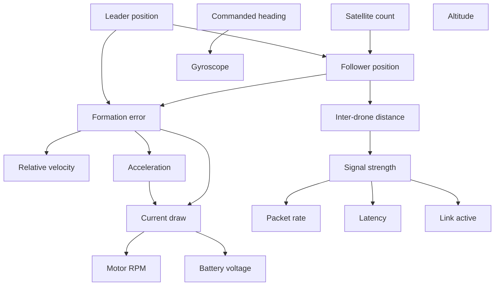

# Causal Swarm Defense

Implementation derived from the course paper "Structural Causal Models for Explainable Cyber
Defense in Multi-Agent Robotic Swarms." The paper argues that machine learning based anomaly
detection identifies statistical deviations in UAV swarm telemetry but cannot explain the
underlying causes of detected anomalies or predict the effects of defensive actions, and
proposes a multi-agent hierarchical defense architecture that integrates fast statistical
anomaly detection with explainable causal reasoning: a lightweight perception agent on each
drone for real time anomaly detection, and a causal decision agent for root cause attribution
and intervention planning using structural causal models and do-calculus.

This repository implements the causal reasoning core of that architecture against simulated
swarm telemetry: a structural causal model fit via maximum likelihood estimation, causal
residual anomaly scoring, root cause attribution, and interventional prediction via backdoor
adjustment, evaluated against a black box baseline. The paper's distributed systems components
(mesh networking, hierarchical Byzantine fault tolerance, the two level orchestrator hierarchy)
are implemented as simplified stand-ins here, since the causal reasoning pipeline is the part
under evaluation.

## Real vs. simulated

Built for real:
- Synthetic multi-drone telemetry simulator (GPS/nav, IMU, comms, formation dynamics, power)
- Causal DAG and structural causal model, fit via MLE
- Causal residual anomaly scoring and Multi-Component Anomaly Index
- Self-supervised autoencoder perception agent
- Root cause attribution (upstream healthy parent search and Shapley causal values)
- Interventional prediction via backdoor adjustment, ranking candidate mitigations
- Attack injectors matching the paper's threat case: slow GPS spoofing, DoS flood, replay
- Evaluation harness: ROC/PR, false positive rate, detection latency, attribution accuracy,
  and a causal pipeline vs. black box baseline comparison
- Causal graph visualization highlighting detected root cause and chosen intervention

Stubbed, explicitly simplified:
- Mesh networking implemented as in-process message passing between Python objects
- Hierarchical Byzantine fault tolerance / PBFT consensus implemented as a simple
  neighbor-consistency trust filter (flags a drone if its self-reported data disagrees with
  the majority of neighbors), same role in the pipeline without the consensus protocol
  complexity
- Two-level orchestrator hierarchy / failover implemented as a config flag disabling the
  top-level coordinator to show sub-swarm orchestrators still function, without real network
  partition handling

## Data schema

Variables are grouped into the five categories used in the paper's causal graph
construction (GPS/nav, IMU, comms, formation dynamics, power). Position and heading use
autocorrelated (AR(1)) noise rather than i.i.d. per-timestep noise, so drift accumulates
smoothly over time instead of jittering, matching the slow GPS spoofing case in the paper's
threat analysis.

| Group | Variable | Type | Scope | Unit / range |
|---|---|---|---|---|
| GPS/Nav | `pos_x`, `pos_y` | continuous | per-drone | meters, local frame |
| | `altitude` | continuous | per-drone | meters |
| | `satellite_count` | continuous | per-drone | roughly 4 to 16 |
| IMU | `accel_x`, `accel_y`, `accel_z` | continuous | per-drone | m/s^2 |
| | `gyro_x`, `gyro_y`, `gyro_z` | continuous | per-drone | rad/s |
| | `mag_heading` | continuous | per-drone | degrees, 0 to 360 |
| Comms | `packet_rate` | continuous | pairwise | packets/sec |
| | `signal_strength` | continuous | pairwise | dBm |
| | `latency` | continuous | pairwise | ms |
| | `link_active` | binary | pairwise | 0 or 1 |
| Formation | `inter_drone_distance` | continuous | pairwise | meters |
| | `relative_velocity` | continuous | pairwise | m/s |
| | `formation_error` | continuous | per-drone | meters |
| Power | `battery_voltage` | continuous | per-drone | volts |
| | `current_draw` | continuous | per-drone | amps |
| | `motor_rpm` | continuous | per-drone | RPM |

Continuous variables use the additive noise structural equation from the paper (eq. 6);
`link_active` uses the logistic form for binary variables (eq. 7).

## Causal graph

One leader drone per sub-swarm follows an exogenous mission trajectory; followers track a
formation slot relative to the leader. Root nodes (leader position, commanded heading,
satellite count, altitude) have no causal parents in the graph.



`battery_voltage` also depends on its own value at the previous timestep (slow discharge
under load); `satellite_count` affects the variance of `pos` noise rather than its mean
(fewer satellites means noisier position readings).

## Structure

```
causal_swarm/
  simulation/     # multi-drone telemetry generator, formation dynamics, attack injectors
  causal/         # DAG definition, SCM fitting, anomaly scoring, attribution, intervention
  perception/     # self-supervised autoencoder detector
  agents/         # perception/decision agents, trust layer stub
  evaluation/     # metrics, baselines, experiment runner
  viz/            # causal graph visualization
notebooks/        # end-to-end demo reproducing the paper's 3-stage cascading attack
tests/
data/             # generated simulation runs, gitignored
reports/          # generated plots/metrics, gitignored
```

## Stack

Python 3.11+, numpy/pandas, networkx, statsmodels (MLE fitting), scikit-learn, PyTorch
(autoencoder), matplotlib (plots and graph viz), pytest, ruff.

## Setup
